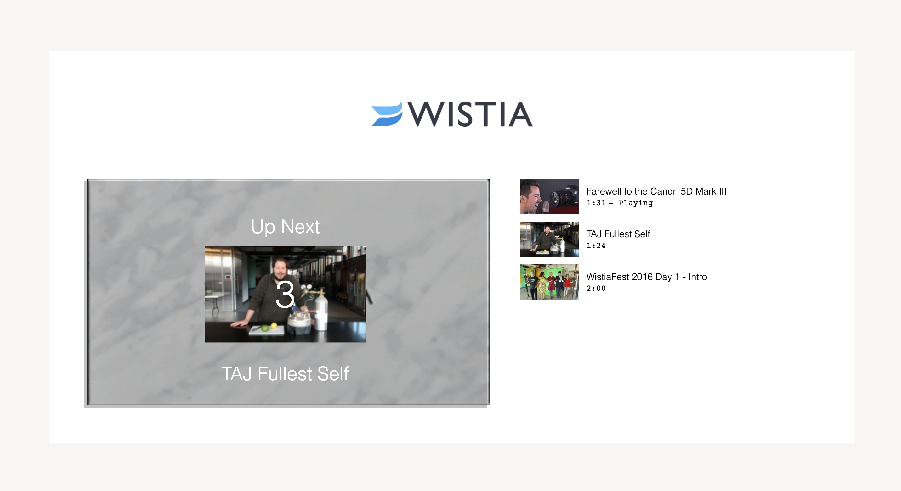
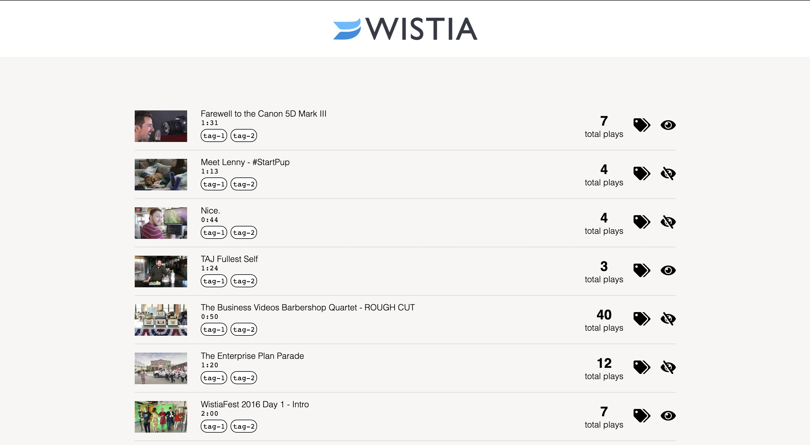
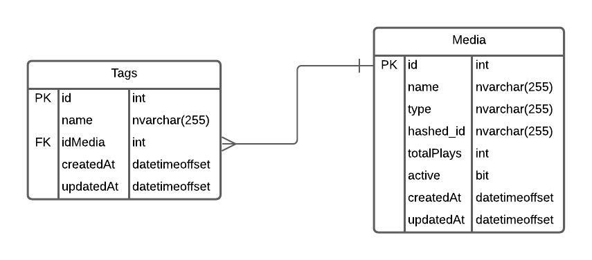

# Uriah's Video Challenge Submission

## Operation Specs 

The project was developed on macOS 11.3.1 ARM chip and Google Chrome Version 91.0.4472.106 (Official Build) (arm64). 

Node version: v14.17.1

Client side utilized plain HTML/CSS/Vanilla.js. 

Server side utilizes Nest.js, a Node.js framework, with Sequelize for an ORM connnecting to an MSSQL instance in a Docker container. You can use any SQL language. Just input the env variable at /assignment/server/src/app.module.ts. If using a different SQL language, you will have to install the relevant drivers. For more information see: (https://docs.nestjs.com/techniques/database#database)

## Client Side 

### Code Style 

Methods implemented to accomplish features are available through current and newly made Prototype objects. 

Here is an example of a send playing status method inside the existing Playlist object:

    var Playlist = {
        sendPlayingStatusToColumn: function(hashed_id, isPlaying) {
            const tag = document.getElementById(hashed_id)
            isPlaying ? tag.innerText = " - Playing" : isPlayingTag.innerHTML = ""
        }
    }

### Create a Playlist

I used the "_all" matcher from the Wistia Javascript Player API to tap into the event callbacks and utilize the appropiate player methods to create a uniform playlist experience. 

Embed links were leveraged to create a fluid playlist by setting playlistLinks=true to the first video.

    document
        .querySelector('.wistia_embed')
        .classList.add('wistia_async_' + medias[0].hashed_id, 'playlistLinks=auto');

Referring back the events driven behavior that the Wistia Javascript Player API support, I utilized the `'play'`, `'secondsChange'`, and `'end'` callbacks implement real time features. You will notice the features involve sending info to be displayed on the video column from various source, or retrieving info from the video column to display on the embed area. 

`Playlist.sendPlayingStatusToColumn(hashed_id: string, isPlaying: boolean)` is used to send is playing status to column. 

`Playlist.addCountDownBanner(nextVideo, currentVideo, second)` retrieves thumbnail and title information from column via `hashed_id `lookup available `video._playlist` object. 

## Server Side

### Dashboard 

In order the create a functional client facing dashboard, it is need to have a record of the historical state. I was not too sure of the solid use case of typical consumers. In this sample project, I noticed that retrieving the same videos from the Wistia API on client load. It would be safe to assume that I should also have a record of these video in my own server so that I can track my own metrics, and dictate visibility of my video. I created a simple Media model with the basic metadata need to associate client side data with my own records. Hashed_id is key here. `Server.seedMedia(medias)` is a one time method to populate the database. 

The model in Nest.js: 

    @Table
    export class Media extends Model {
        @Column
        name: string;

        @Column
        type: string;

        @Column
        hashed_id: string;

        @Column({allowNull: false, defaultValue: 0})
        totalPlays: number; 

        @Column({allowNull: false, defaultValue: true})
        active: boolean 

        @HasMany(() => Tag)
        tags: Tag[]
    }

Media data from the server is loaded on page initialization along with the media data from the Wistia API. The historical data (totalPlays and visibility) from the server is attached to the medias retrieved from the Wistia API. 

    async function() {
      const serverMedias = await Server.findAllMedia()
      Dashboard.getMedias().then(function(response) {
        response.data.map(function(media) {
          // Server.seedMedias(media)
          const serverMedia = serverMedias.find( m => m.hashed_id === media.hashed_id)
          const combinedMediaInfo = {...media, totalPlays: serverMedia.totalPlays, active: serverMedia.active }
      
          Dashboard.renderMedia(combinedMediaInfo);
        });
      });
    },

Notice the two liner: 

    const serverMedia = serverMedias.find( m => m.hashed_id === media.hashed_id)
    const combinedMediaInfo = {...media, totalPlays: serverMedia.totalPlays, active: serverMedia.active }

`Server.toggleMedia(event, isActive)` is used to update Media.active column to true/false. 

### Playlist 

Similiar to the dashboard, server data is loaded on page initialization. `Server.filterActiveMedia(response.data)` returns an array of active hashed_id confirmed by the server to filter the medias to be rendered from the Wistia API. 

    Playlist.getMedias().then(async function(response) {
        var medias = await Server.filterActiveMedia(response.data)
        ...

A simple findAll querying the database: 

    async findAllActiveMedia() {
        return await this.mediaEntity.findAll({
        where: { active: true }
        })
    }

## Search by tag feature 

`SELECT COUNT(Media.[totalPlays]) From Media WHERE [Media].[totalPlays] > 1` will return the total number of videos that have been played at least once. 

Schema for tag feature:

## Conclusion 

I have done projects with little guardrails before so I really appreciated the well organized project in light of it being in plain Javascript. It speaks well of good design thinking. I strived to follow the same design pattern by making the code self documenting. 

I was very interesting getting to work with the Wistia Javascript Player API for the first time. I had to read a bit to understand the intended functionality of the Player API as well as the Embed Links. In the end, the '_all' matcher proved to be a very useful way to create a predicatable video experience. 

It is quite simple to plug in a backend of any language to start collecting basic metrics on media items. I would like to have the opportunity in the future to have a more fullsome developer experience of what the Wistia API is capable of in regards creating vorality for company brands. 

